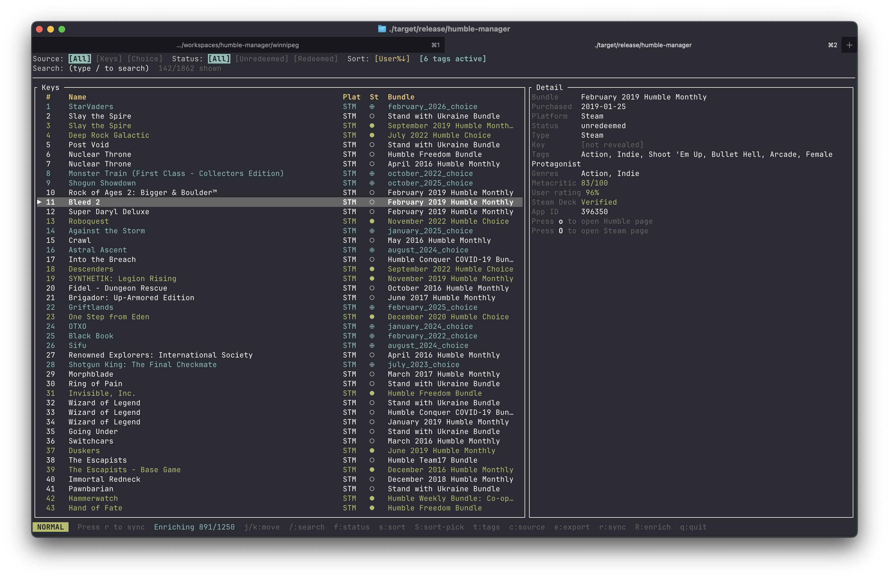

# humble-manager

A terminal UI for browsing, filtering, and managing your Humble Bundle game keys and Choice picks.




## Features

- Browse all your Humble Bundle keys in a fast, keyboard-driven TUI
- Filter by status (Unredeemed / Redeemed / All), source (Keys / Choice / All), and sort order
- Live fuzzy search across game names
- Humble Choice picks shown alongside keys, with claim deadlines
- Press `o` to open the Humble download/claim page for any item in your browser
- Press `y` to yank a revealed key value to clipboard
- Export the current filtered view to CSV
- SQLite cache — loads instantly on startup, syncs on demand
- Sync suggested (never forced) when cache is more than a day old

## Installation

Requires Rust (stable). Build from source:

```bash
cargo build --release
cp target/release/humble-manager ~/.local/bin/
```

## Setup

You need a `_simpleauth_sess` session cookie from a logged-in Humble Bundle browser session:

1. Log in to [humblebundle.com](https://www.humblebundle.com) in your browser
2. Open DevTools → Application (Chrome) or Storage (Firefox) → Cookies
3. Copy the value of `_simpleauth_sess`
4. Run `humble-manager` — it will prompt you to paste it on first launch

The cookie is stored in `~/Library/Application Support/humble-manager/config.toml` on macOS.

## Usage

```
humble-manager
```

### Keybindings

| Key | Action |
|-----|--------|
| `j` / `k` or `↓` / `↑` | Move selection |
| `g` / `G` | Jump to top / bottom |
| `Ctrl+d` / `Ctrl+u` | Page down / up |
| `/` | Search (live fuzzy filter) |
| `f` | Cycle status filter (All → Unredeemed → Redeemed) |
| `s` | Cycle sort order |
| `t` | Open genre/tag filter picker |
| `c` | Cycle source (All → Keys → Choice) |
| `o` | Open Humble download / claim page in browser |
| `O` | Open platform store page (Steam, GOG, Epic, etc.) |
| `y` | Yank revealed key value to clipboard |
| `r` | Start a full sync |
| `R` | Enrich library with Steam genres/tags and IGDB ratings |
| `e` | Export current view to CSV |
| `q` / `Ctrl+c` | Quit |

### Sync

humble-manager never syncs automatically. On startup it loads from the local SQLite cache. If the cache is more than 24 hours old you'll see a prompt — press `r` to sync or any other key to dismiss and use the cached data.

### Metadata enrichment (`R`)

Press `R` to fetch game metadata from Steam and (optionally) IGDB. This enriches each game in your library with:

- **Tags** — user-voted folksonomy tags from SteamSpy (e.g. "Roguelike", "Souls-like", "Co-op")
- **Genres** — Valve-assigned genres from Steam, or IGDB's standardized taxonomy if configured
- **Metacritic score** — pulled from the Steam store page
- **User rating %** — positive review percentage derived from SteamSpy vote counts
- **IGDB rating** — aggregated critic score from IGDB (requires credentials, see below)
- **Steam Deck compatibility** — Verified / Playable / Unsupported, from the Steam store

Metadata is stored locally and survives restarts. Enrichment only covers items that have a Steam App ID. Run `R` again any time to refresh.

### Genre/tag filter (`t`)

Press `t` to open the genre and tag picker. It shows every tag and genre across your enriched library, sorted by how many games carry it.

| Key | Action |
|-----|--------|
| `j` / `k` | Move up/down |
| `Space` | Toggle the highlighted tag |
| Type | Filter the list by name |
| `Enter` | Apply selected tags and close |
| `Esc` | Close without changing the filter |
| `Ctrl+c` | Clear all selected tags |

Active tag filters are shown in the filter bar. A game must match **at least one** selected tag to be shown. Games without enrichment metadata are hidden while a tag filter is active.

**Rate limiting:** enrichment fetches one game at a time with a short delay to respect Steam's and SteamSpy's rate limits. Expect roughly 1–2 seconds per game.

#### Setting up IGDB (optional)

IGDB is owned by Twitch and requires a free Twitch developer account:

1. Go to [dev.twitch.tv/console](https://dev.twitch.tv/console) and log in (or create a Twitch account)
2. Click **Register Your Application**
3. Fill in any name, set the OAuth Redirect URL to `http://localhost`, choose category **Other**, and set the type to **Confidential** (required — public apps don't receive a client secret)
4. Copy the **Client ID** and generate a **Client Secret**
5. Add them to your config file (`~/Library/Application Support/humble-manager/config.toml`):

```toml
[igdb]
client_id = "your_client_id_here"
client_secret = "your_client_secret_here"
```

Without IGDB credentials, enrichment still runs using Steam data only (genres, Metacritic, tags).

## Data

All data is cached locally in SQLite. On macOS:

| File | Path |
|------|------|
| Config | `~/Library/Application Support/humble-manager/config.toml` |
| Database | `~/Library/Application Support/humble-manager/cache.db` |
| Log | `~/Library/Application Support/humble-manager/humble-manager.log` |

## License

MIT — see [LICENSE](LICENSE)
